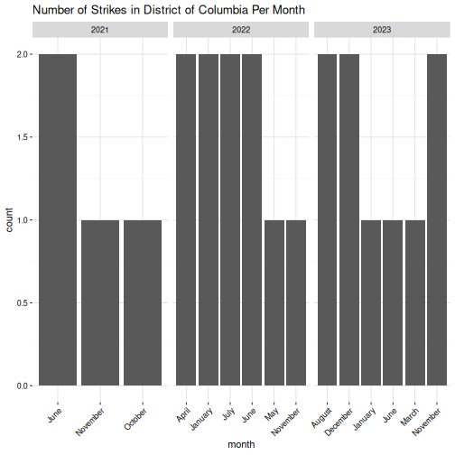
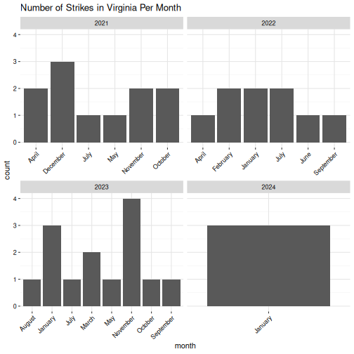

---
title: "My R Markdown Document"
output:
  html_document:
    theme: cerulean
---


# Introduction


Code chunk connects to a database and generates tables from from the database.

## Loading the database

Here is the code chunk


```r
source("~/Lab2/Trade_Union_Global_Analysis/summary_analysis/Enviroment_Setup.R")
```

```
## Warning in eval(ei, envir): NAs introduced by coercion

## Warning in eval(ei, envir): NAs introduced by coercion

## Warning in eval(ei, envir): NAs introduced by coercion

## Warning in eval(ei, envir): NAs introduced by coercion
```

```r
suppressPackageStartupMessages({
  library(ggplot2)
  library(dplyr)
})

# connect to the database and pull out the sheet
setwd("~/workbook")
con <- dbConnect(RSQLite::SQLite(), "trade_union_data.db")
dbListTables(con)
```

```
##  [1] "CBCR"                                    
##  [2] "CollectiveBargaining"                    
##  [3] "ILRLaborActionTracker"                   
##  [4] "IRL&ScrappedDataComparision"             
##  [5] "LAT-02.19.24"                            
##  [6] "LAT-03.04.24"                            
##  [7] "LAT-04.01.24"                            
##  [8] "State_Union_Coverage_Density_1977-2021"  
##  [9] "State_Union_Membership_Density_1964-2021"
## [10] "Strikes_United_States"                   
## [11] "TUDR"                                    
## [12] "TradeUnionDensity"                       
## [13] "WorkplaceRights"                         
## [14] "raw_strike_table"                        
## [15] "rawonlystrike_table"                     
## [16] "state_union_coverage_density_long"       
## [17] "state_union_membership_density_long"     
## [18] "state_uniondc_join"                      
## [19] "strike_table"                            
## [20] "summarytable_IRLvSData"
```

```r
february <- as_tibble(dbReadTable(con, "LAT-02.19.24"))
```

```
## Warning: Column `ZipCode`: mixed type, first seen values of type integer,
## coercing other values of type string
```

```r
dbDisconnect(con)
```
## prepping the data in table for an analysis

The below chunk edits ZipCode's BargainingUnitSize ApproximateNumberofParticipants to their related data types


```r
# Convert Timestamp column to POSIXct format
february$Timestamp <- as.POSIXct(february$Timestamp,
  format = "%m/%d/%Y %H:%M:%S"
)

# mutate zip code to a character
february <- february %>%
  mutate(
    ZipCode = as.character(ZipCode),
    BargainingUnitSize = parse_number(as.character(BargainingUnitSize)),
    ApproximateNumberofParticipants =
      parse_number(as.character(ApproximateNumberofParticipants)),
    Date = format(Timestamp, "%Y-%m-%d"),
    month = format(Timestamp, "%B"),
    Year = format(Timestamp, "%Y"),
    DurationAmount = as.integer(DurationAmount)
  )
```
## check for missing data against the spreedsheet

```
## [1] "the total number of available data points in the BargainingUnitSize vector is 211"
```

```
## [1] "the total number of missing/blank data points in the BargainingUnitSize vector is 2655"
```

```
## [1] "the total number of missing/blank data points in the notes vector is 380"
```
## the function to generate bar charts from various state and year vector

```r
monthly_plot <- function(state_var, year_var) {
  if (length(year_var) == 1) {
    d <- february %>%
      filter(State == state_var, Year == year_var) %>%
      ggplot(aes(x = month)) +
      geom_bar() +
      labs(title = paste("Number of Strikes in", state_var)) +
      common_theme()
  } else {
    d <- february %>%
      filter(State == state_var, Year %in% year_var) %>%
      ggplot(aes(x = month)) +
      geom_bar() +
      labs(title = paste("Number of Strikes in", state_var, "Per Month")) +
      facet_wrap(~Year, scales = "free_x") +
      common_theme()
  }
  return(d)
}
years <- c("2021", "2022", "2023", "2024")
```


```r
monthly_plot("District of Columbia", years)
```



```r
monthly_plot("Maryland", years)
```


```r
monthly_plot("Virginia", years)
```


```

